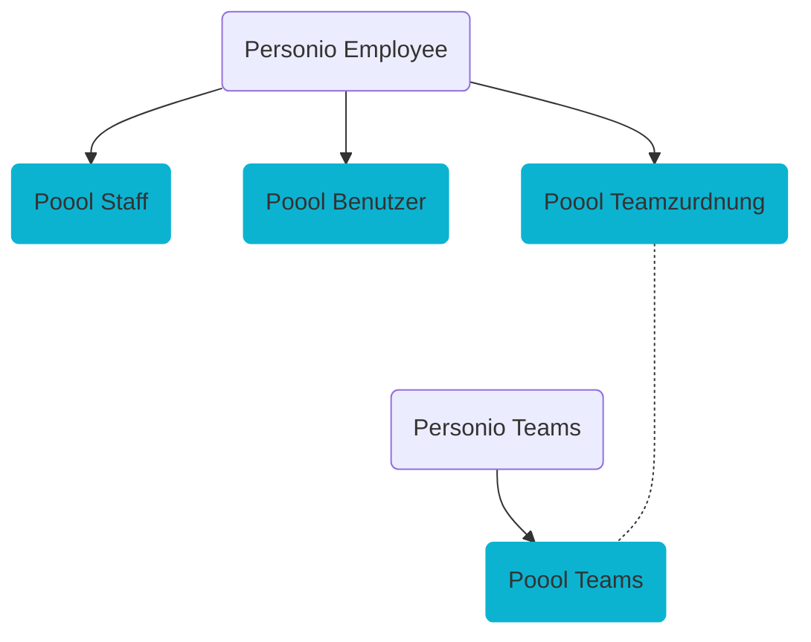

# Personio Schnittstelle

Published: No
Suggested: No

Personio kann folgende Entitäten sncen

- Mitarbeiter
- Benutzer
- Teams
- Ab- und Anwesenheiten

```mermaid
graph TD
  PerE(Personio Employee) --> PooolStaff(Poool Staff)
  PerE --> PooolUser(Poool Benutzer)
  PerE --> PooolStaffTeam(Poool Teamzurdnung)
  
  PerTeam(Personio Teams) --> PooolTeams(Poool Teams)
  
  PooolStaffTeam -...- PooolTeams
  
	classDef Poool fill:#0cb3d1,stroke:#0cb3d1
	class PooolStaff,PooolUser,PooolStaffTeam,PooolTeams Poool

```

# Mitarbeiter und Benutzer